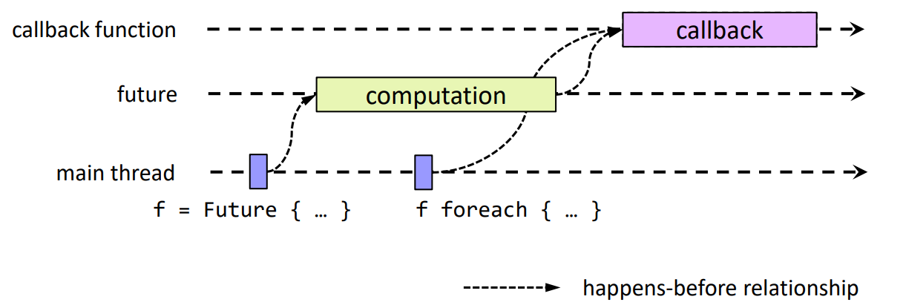
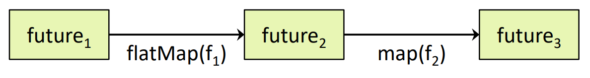
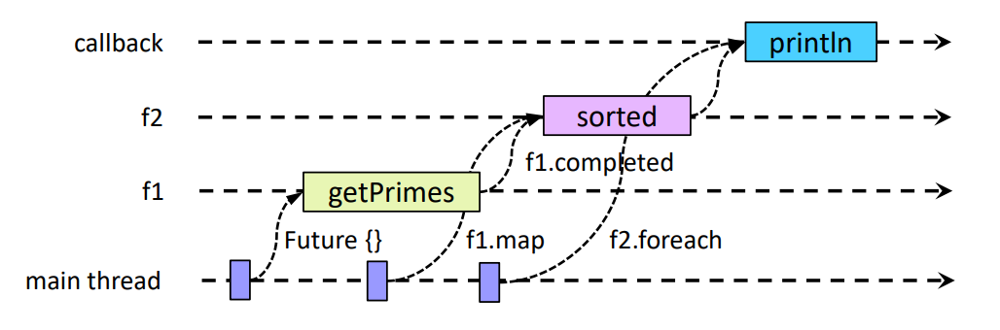
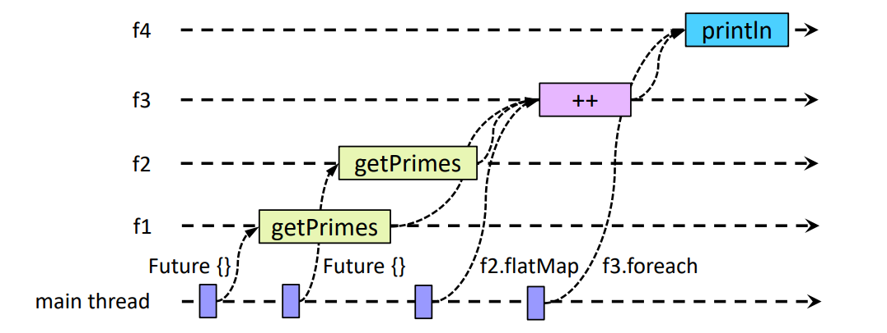
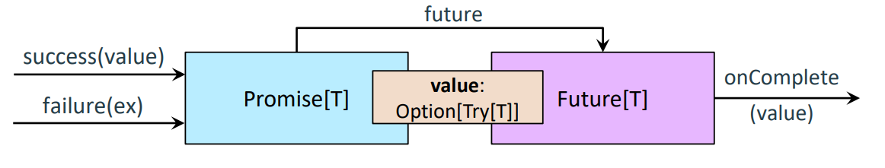

## Asynchrone Programmierung
In bestimmten Situationen müssen Threads auf externe Ressourcen warten (z.B. auf Daten, die über das Netzwerk ankommen). Herkömmliche Programme blockieren in solchen Fällen die Threads.

Mögliche Probleme mit blockierender Synchronisation:
- Schlechte Nutzung von Threads
- Gefahr von Deadlocks
- Starvation von Thread-Pools

Bei asynchroner Programmierung:
- Wenn ein Thread auf eine Ressource warten muss, wird eine separate Ausführung eingeplant
- Der Thread setzt seine Arbeit fort
- Die ursprüngliche Ausführung wird fortgesetzt, sobald die Ressource verfügbar ist
- Das verhindert teure Kontextwechsel

**Futures** und **Promises** sind Abstraktionen, die asynchrone Programmierung unterstützen. Sie punkten mit:
- Bessere Ressourcennutzung
- Vermeidung von Blocks
- Flexiblere Programmierung bei I/O-lastigen oder Netzwerk-Aufgaben
- hohe Systemperformance durch effiziente Thread-Nutzung
  
## Futures
Ein `Future`:
- Ist ein Platzhalter für einen Wert vom Typ `T` → zukünftiger Wert
- Führt eine asynchrone Berechnung durch → zukünftige Berechnung
```scala
trait Future[T]:
  def value: Option[Try[T]]

object Future:
  def apply[T](computation: => T): Future[T]
```
```scala
// Aufruf
val f: Future[Int] = Future {
  computeNthPrime(1000)
}

// Nicht empfohlen :D
println(f.value) // → Zunächst None

while (!f.isCompleted) {
  Thread.sleep(100)
}

println(f.value) // → Nun Some(Success(7919))
```
Kernpunkte:
- `Future` repräsentiert eine Berechnung, die asynchron ausgeführt wird
- Der Wert ist zunächst nicht sofort verfügbar
- Blockierendes Warten ist in der Praxis zu vermeiden
- Die Berechnung läuft im Hintergrund

Die Ermittlung des Wertes des `Future`-Objekts wird in einem `ExecutionContext` ausgeführt. Dieser wird in der zweiten Parameterliste angeführt und wird oft implizit übergeben.

```scala
object Future:
  def apply[T](computation :=>T)(using executor: ExecutionContext): Future[T] 
```

## Future Callbacks

Callbacks sind (partielle) Funktionen die aufgerufen werden, wenn die Future-Ausführung erfolgreich durchgeführt wurde oder fehlgeschlagen hat. Der Aufruf erfolgt **nachdem** die Ausführung abgeschlossen wurde und ist unabhängig von anderen Callbacks.
```scala
trait Future[T]:
  def foreach(f: T => U) // success
  def failed: Future[Throwable] // Failure(ex) → Success(ex)
  def onComplete(f: Try[T] => Unit) // success or failure
```
Beispiel-Verwendung:
```scala
val f: Future[List[Int]]= Future { getPrimes(100) }

f foreach {
  primes => println(primes.mkString(", "))
}

f.failed foreach {
  ex => println(s"Failed with $ex")
}

f onComplete {
  case Success(primes) => println(primes.mkString(", "))
  case Failure(ex) => println(s"Failed with $ex")
}
```

Die Registierung des Callbacks ist eine nicht blockierende Operation. (Genauso wie die Erstellung des Futures). Die Ausführung des Callbacks kann (muss aber nicht) in einem separaten Thread erfolgen.

```scala
val f = Future { computation }
f foreach { callback }
```



## Funktionale Komposition mit Futures
Probleme mit Callbacks:
- Verkettung von Futures wird umständlich (verschachtelte Callbacks)
- Kombinieren von Ergebnissen mehrerer Futures ist schwierig
- Fehlerbehandlung wird unübersichtlich

Funktionale Komposition ist ein Pattern, bei dem Funktionen mithilfe von Funktionen höherer Ordnung, sogenannten Kombinatoren, verkettet werden. Monaden bieten Kombinatoren und sind daher ein wichtiges Mittel zur funktionalen Komposition.


Futures unterstützen Kombinatoren wie `map`, `flatMap`, `filter` usw., mit denen Pipelines von Future-Berechnungen aufgebaut werden können.



Kombinatoren generieren Futures von Futures `Future[Future[T]]`.
```scala
trait Future[T]:
  def map[S] (f: T => S) : Future[S]
  def flatMap[S](f: T => Future[S]) : Future[S]
  def filter (p: T => Boolean) : Future[T]
  def recover[U >: T](pf: PartialFunction[Throwable, U]) : Future[U]
```

- `map`:
  - Wendet eine Funktion `f` auf den Future-Wert an
  - `f` wird in einem neuen Future ausgeführt
  - Ausnahmen werden an den neuen Future weitergeleitet
- `flatMap`
  - Ähnlich wie `map`, aber das Ergebnis wird nicht verschachtelt
    ```scala
    val f1: Future[Int] = Future { 1 }
    val f2 = f1 map { i => Future { i+1 } } 
    // → f2: Future[Future[Int]]

    val f1: Future[Int] = Future { 1 }
    val f2 = f1 flatMap { i => Future { i+1 } } 
    // → f2: Future[Int]
    ```
- `recover`
  - Behandelt Ausnahmen, die in Future-Berechnungen auftreten
  - Gültige Ergebnisse werden an den neuen Future weitergeleitet
    ```scala
    val f1 = Future (6 / 0) recover { case e: ArithmeticException => 0 }
    ```
Beispiele aus den Folien:
```scala
// recover
val f1 = Future (6 / 0) recover { case e: ArithmeticException => 0 } // Success(0)

val f2 = Future (6 / 0) recover { case e: NullPointerException => 0 } // Failure(ArithmeticException)

val f3 = Future (6 / 2) recover { case e: ArithmeticException => 0 } // Success(3)

// map
val f1: Future[List[Int]]= Future { getPrimes(100) }

val f2: Future[List[Int]] = f1 map { primes => primes.sorted }

f2 foreach { primes => println(primes.mkString(", ")) }

// flatMap
val f1 = Future { getPrimes(2, 50) }

val f2 = Future { getPrimes(51, 100) }

val f3 = f2 flatMap { primes2 => f1 map { primes1 => primes1 ++ primes2 } }

val f4 = f3 map { primes => primes.sorted }

f4 foreach { primes => println(primes.mkString(", ")) }
```

**Semantische Bedeutung des `map`-Kombinators bei Futures**
```scala
val f1: Future[List[Int]]= Future { getPrimes(100) }
val f2: Future[List[Int]] = f1 map { primes => primes.sorted }
f2 foreach { primes => println(primes.mkString(", ")) } 
```



Die Futures und Kombinatoren können (müssen aber nicht) in unterschiedlichen Threads ausgeführt werden.

**Semantische Bedeutung des `flatMap`-Kombinators bei Futures**
```scala
val f1 = Future { getPrimes(2, 50) }
val f2 = Future { getPrimes(51, 100) }
val f3 = f2 flatMap { primes2 => f1 map { primes1 => primes1 ++ primes2 } }
f3 foreach { primes => println(primes.mkString(", ")) }
```



Unterschiede zwischen `Future.flatMap` und `Future.map`:

```scala
f: Future[U]
g: U => V
```
`flatMap`
```scala
val res = f flatMap { u => Future { g(u) } }
```
Ausführungsreihenfolge:
- Future `f` wird mit einem Wert vom Typ `U` abgeschlossen
- Future `{ g(u) }` wird mit einem Wert vom Typ `V` abgeschlossen
- Future `res` wird mit dem Wert vom Typ `V` abgeschlossen
- Rückgabetyp: `Future[V]`

`map`
```scala
val res = f map { u => Future { g(u) } }
```
Ausführungsreihenfolge:
- Future `f` wird abgeschlossen
- Future `res` wird mit einem Wert vom Typ `Future[V]` abgeschlossen
- `Future { g(u) }` wird abgeschlossen
- Rückgabetyp: `Future[Future[V]]`

Hauptunterschiede:
- `flatMap` vereinfacht die Verschachtelung von Futures
- `map` erzeugt eine verschachtelte Future-Struktur

`flatMap` ist daher nützlich, um asynchrone Berechnungen direkt zu verketten.


## Futures und For-Expressions

Futures können auch mittels For-Comprehension kombiniert werden. Das führt zu einer gut lesbaren Programm-Struktur.

Ohne For-Comprehension
```scala
val f1 = Future { getPrimes(2, 50) }
val f2 = Future { getPrimes(51, 100) }

val f3 = f2 flatMap { primes2 => f1 map { primes1 => primes1 ++ primes2 } }

f3 foreach { primes => println(primes.mkString(", ")) } 
```

Mit For-Comprehension
```scala
val f1 = Future { getPrimes(2, 50) }
val f2 = Future { getPrimes(51, 100) }

val f3 = for (
              primes1 <- f1;
              primes2 <- f2
          ) yield primes1 ++ primes2

for (primes <- f3) println(primes.mkString(", ")) 
```
Die Anwendung der for-Comprehension ist möglich da Futures die Operationen `map`, `flatMap`, `foreach` (und `withFilter`) unterstützen.

## Promises
Futures und Promises repräsentieren zwei Aspekte einer "Single-Assignment" Variable (Eine Variable, der nur einmal ein Wert zugewiesen werden kann.
- Das *Promise* erlaubt es, dem *Future* einen Wert zuzuweisen
- Das *Future* erlaubt es, den Wert zu lesen



Beispiel:
```scala
val p = Promise[String]()
  p.future onComplete {
  case Success(v) => println(v)
  case Failure(ex) => println(ex)
}
p success "Hello"
// p.failure new Exception("failed")
```
- Ein Promise kann über die Methoden `success(value)` oder `failure(ex)` einen Wert oder Fehler setzen
- Über die `future`-Methode erhält man Zugriff auf das Future
- Das Future stellt den Wert über value: `Option[Try[T]]` bereit
- Über `onComplete` kann man Callbacks registrieren, die ausgeführt werden, wenn der Wert verfügbar ist


>**Wichtig**: Ein Wert kann einem Future nur einmal zugewiesen werden.

- Die Methoden `success`, `failed` und `complete` werfen eine Exception, wenn man versucht einen bereits gesetzten Wert zu überschreiben.
- Die Methoden `trySuccess`, `tryFailed` und `tryComplete` geben stattdessen einen Rückgabewert zurück, der anzeigt ob die Zuweisung erfolgreich war.

Man kann Futures auch mit Promises realisieren.
Beispiel aus den Folien:
```scala
import ExecutionContext.Implicits.global

def doInFuture[T](computation: => T): Future[T] = {
  val p = Promise[T]()
  global.execute(() => 
    try {
      val result = computation
      p success result
    }
    catch {
      case NonFatal(e) => p failure e
    }
  )
  p.future
}
```

### Futures und Blocking

Wenn alle Threads des Thread-Pools blockiert sind, kann keine weitere Future-Berechnung gestartet werden.

Problematisches Beispiel:
```scala
var futures = for (_ <- 1 to noProcessors) 
  yield Future { Thread.sleep(1000) }
val f = Future { ... }  // wird erst nach 1000ms starten
```
Dies ist ein Problem, da alle verfügbaren Threads durch sleep() blockiert sind (Größe des Threadpools normalerweise `noProcessors`) Die Situation wird Thread-Starvation genannt: gemeinsam genutzte Ressourcen werden für lange Zeit von gready Threads unzugänglich gemacht.

Bessere Lösung:
```scala
var futures = for (_ <- 1 to noProcessors) 
  yield Future { blocking { Thread.sleep(1000) } }
val f = Future { ... }  // kann sofort starten
```
`blocking` sollte wann immer möglich vermieden werden.
- Der ExecutionContext wird zusätzliche Worker-Threads bereitstellen, wenn nötig 
- Durch die Verwendung von `blocking` wird dem System signalisiert, dass möglicherweise zusätzliche Threads benötigt werden