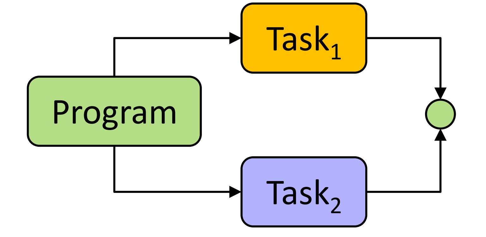
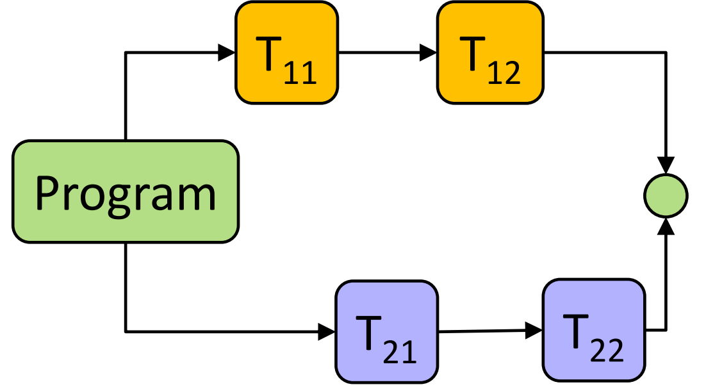
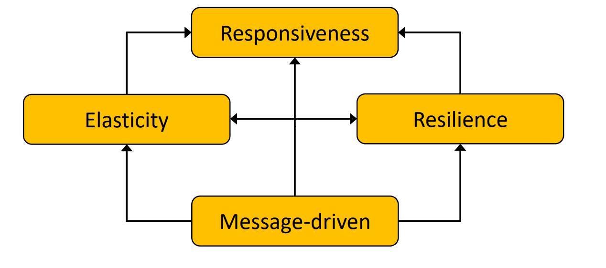
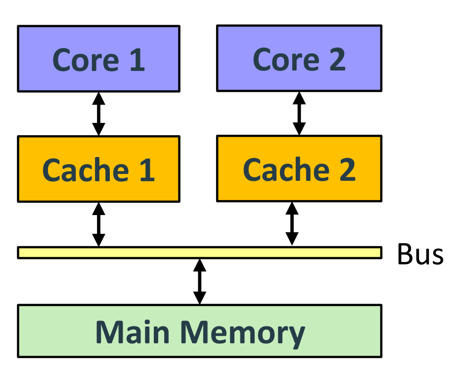
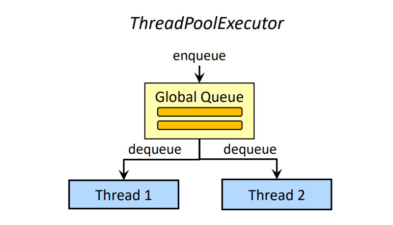
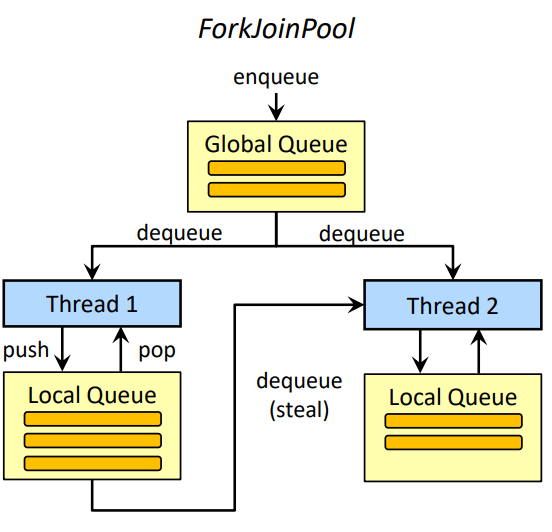
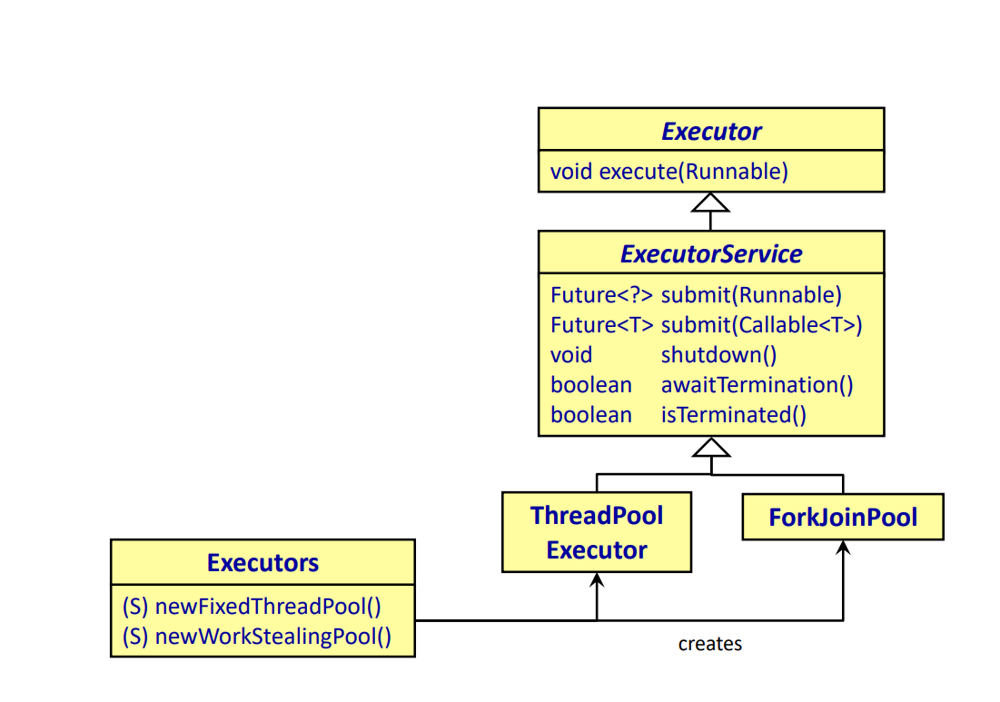
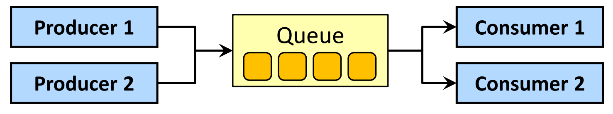

## Concurrency vs Parallelism

**Parallelität (Parallelism):**
- Techniken zur Beschleunigung von Programmen durch gleichzeitige Ausführung von Berechnungen
- Erfordert mehrere CPUs
- Berechnungseinheiten müssen unabhängig sein
- Ziel: Steigerung der Laufzeiteffizienz



**Nebenläufigkeit (Concurrency):**
- Programm macht Fortschritte bei mehreren Aufgaben zur gleichen Zeit
- Nebenläufige Programme können auf einer einzelnen CPU ausgeführt werden, können aber von mehreren CPUs profitieren
- Ziel: Effiziente Interaktion mit mehreren externen Agenten ermöglichen
- Nebenläufigkeit schließt Parallelität mit ein



**Im wesentlichen:**
- Parallelität bezieht sich auf die tatsächlich gleichzeitige Ausführung von Aufgaben (z.B. auf mehreren Prozessorkernen)
- Nebenläufigkeit beschreibt die Fähigkeit eines Programms, mehrere Aufgaben zu verwalten und voranzutreiben, auch wenn sie nicht unbedingt exakt gleichzeitig ausgeführt werden

## Reaktive Systeme
- Definition von *reaktiv*: “Showing a response to a stimulus. Pupils are reactive to light” *[Oxford Dictionaries]*

- Das Reaktive Manifesto: Beschreibt die Eigenschaften von reaktiven Systemen


- Nachrichtenbasiert (Message-driven): Reagiert auf Events
  - Reaktive Systeme basieren auf asynchroner Nachrichtenübermittlung → keine Blockierung
  - Gewährleistet lose Kopplung von Komponenten → Standort-Transparenz
  - MessageQueues ermöglichen Lastmanagement
  - Auch Fehler werden über Nachrichten kommuniziert
- Elastizität (Elasticity): Reagiert auf Last
  - Das System bleibt auch unter wechselnder Arbeitslast reaktionsfähig
  - Vertikale Skalierung (Scale up): Nutzung mehrerer Kerne, Erhöhung des Arbeitsspeichers
  - Horizontale Skalierung (Scale out): Nutzung mehrerer Server-Knoten
  - Dafür muss erfüllt sein:
    - Minimierung veränderbarer Zustände
    - Standort-Transparenz und Resilienz
- Resilienz (Resilience): Reagiert auf Fehler
  - Das System bleibt auch bei Auftreten von Fehlern reaktionsfähig
  - Teile des Systems können ausfallen und sich erholen, ohne das Gesamtsystem zu gefährden
  - Die Wiederherstellung jeder Komponente wird an eine andere Komponente delegiert
  - Dafür muss erfüllt sein:
    - Kapselung des Zustands
    - Überwachungshierarchien (Supervisor-Konzepte)
- Reaktionsfähigkeit (Responsiveness): Reagiert auf User *(User muss nicht Mensch sein)*
  - System muss Echtzeit-Interaktion mit Agents unter Last und bei Auftreten von Fehlern gewährleisten
  - Voraussetzungen: Nachrichtenbasierte Architektur, Elastizität, Resilienz

## Herkömmliche Techniken für nebenläufige Programmierung
- Low-Level-Konstrukte für nebenläufige Ausführungen:
  - Prozesse
  - Threads
- Kommunikationsmittel:
  - Gemeinsamer Speicher (Shared Memory) → Synchronisation erforderlich
  - Nachrichtenaustausch (Message Passing) → verteilte Systeme
- **Probleme:** Fehleranfällig und auf niedriger Abstraktionsebene
  - Deadlocks
  - Race Conditions
  - Data Races
  - Starvation

Grundlegendes Wissen über Low-Level-Ansätze ist essentiell, um High-Level-Konzepte zu verstehen :smile:

## Prozesse und Threads
- Ein Prozess führt die Anweisungen eines Programms aus:
  - Teilt sich CPU und andere Ressourcen mit anderen Prozessen
  - Hat seinen eigenen Speicherbereich
- Die Anweisungen eines Prozesses werden nebenläufig in mehreren Threads ausgeführt:
  - Threads teilen sich den Speicher des Prozesses, zu dem sie gehören
  - Threads kommunizieren durch Schreiben und Lesen im Speicher
- Die Anweisungen eines Prozesses werden nebenläufig in mehreren Threads ausgeführt:
  - Threads teilen sich den Speicher des Prozesses, zu dem sie gehören
  - Threads kommunizieren durch Schreiben und Lesen im Speicher
- Threads können auf verschiedenen Prozessoren (Kernen) ausgeführt werden:
  - Prozessoren schreiben nicht direkt in den Hauptspeicher
  - Sie nutzen Caches zur Verbesserung der Lese-/Schreib-Performance
  - Ein Prozessor kann nicht auf den Cache eines anderen Prozessors zugreifen
- Java-Threads werden direkt auf Betriebssystem-Threads abgebildet ( ab Java21 auch das Konzept von VirtualThreads, das bleibt jetzt aber außen vor)
- Scala übernimmt das Thread-Modell von Java
  


## Java Memory Model (JMM)
- Scala übernimmt das Speichermodell von der JVM.
- Das Speichermodell definiert, wann Schreibzugriffe auf eine Variable für andere Threads sichtbar sind.
- Der Compiler und die Laufzeitumgebung führen verschiedene Optimierungen durch, um Performance zu gewinnen:
  - Register können als Zwischenspeicher verwendet werden
  - Daten können in Hierarchien von Caches geschrieben werden
  - Bytecode-Anweisungen können umgeordnet werden
- Die Regeln des JMM definieren, wie Threads über den Speicher interagieren:
  - Programm-Reihenfolge (Program order): Programmoptimierungen durch den Compiler dürfen die serielle Semantik innerhalb eines Threads nicht verändern
  - Locks: Sperren für die gleiche Synchronisationsvariable dürfen sich nicht überlappen
  - Volatile fields: Ein Schreibzugriff auf ein volatiles Feld ist sofort für alle Threads sichtbar
  - Thread-Start: Alle Aktionen in einem Thread werden nach dem Aufruf von start() ausgeführt

## Threads in Scala

Ein Thread is leicht erstellt:
```scala
class MyThread extends Thread:
  override def run(): Unit =
    println("Executed in new thread.")

val t = new MyThread
t.start()
```
Hilfsmethode aus den Folien mit call-by-name Parameter:
```scala
def doInThread(body: => Unit): Thread =
  val t = new Thread:
    override def run() = body
  t.start()
  t

// Aufruf
val t = doInThread { println("Executed in new thread.") }
```
Wenn mehrere Threads auf die gleichen Speicherbereiche zugreifen, ist das Programmverhalten nicht mehr deterministisch.
```scala
var currId = 0L
def generateUniqueId() =
  val newId = currId + 1 // (1)
  currId = newId // (2)
  newId

// Aufruf
val t1 = doInThread { println(generateUniqueId()) }
val t2 = doInThread { println(generateUniqueId()) }
// Ausgabe: 1 2 oder 2 1 oder 1 1
```
Der Code funktioniert korrekt, wenn die Ausführung der Anweisungen (1) und (2) nicht durch den anderen Thread unterbrochen wird. `t1` und `t2` generieren jedoch die gleiche ID, wenn beide Threads gleichzeitig das Feld currId lesen. Man spricht von einer **Race Condition** in einem Programm, wenn die Ausgabe von der Ausführungsreihenfolge der Anweisungen abhängt.

## Synchronisation
- Jedes Java/Scala-Objekt besitzt eine spezielle Eigenschaft, die als *intrinsic lock* oder *Monitor* bezeichnet wird.
- Nur ein Thread kann den Besitz eines Locks erlangen.
- Wenn ein Thread versucht, den Lock zu erlangen, während ein anderer Thread den Lock besitzt, wird dieser Thread blockiert.
- Wenn ein Thread die Anweisung ausführt:
  ```scala
  x.synchronized { /* Anweisungen */ }
  ```
  - versucht er die Sperre für `x` zu erlangen, die am Ende des Blocks wieder freigegeben wird
  - der Thread wird blockiert, solange `x` von einem anderen Thread gesperrt ist
- Die Race Condition im obrigen Beispiel kann durch Locken des von mehreren Threads zugegriffenen Bereichs beseitigt werden:
```scala
var currId = 0L
def generateUniqueId() = this.synchronized
  val newId = currId + 1
  currId = newId
  newId
```

## Data Races und Umreihung
- Wie kann dieses Programm zu `x==1 && y==1` führen?
  ```scala
  var a = false
  var b = false
  var x = -1
  var y = -1

  val t1 = doInThread { 
    a = true
    y = if (b) 0 else 1
  }

  val t2 = doInThread {
    b = true
    x = if (a) 0 else 1
  }

  t1.join()
  t2.join()

  assert(!(x == 1 && y == 1))
  ```
- Es ist erforderlich, dass sowohl a als auch b false sind, um `x==1 && y==1` als Ergebnis zu erhalten.
- Mögliche Gründe für dieses "anormale" Verhalten:
  - Umreihung von Anweisungen: Diese Umordnung hat keine Auswirkung auf die serielle Semantik, beeinflusst aber das Verhalten bei nebenläufiger Ausführung
  - Data Racee: Schreibzugriff eines Threads (im Cache) wird vom anderen Thread nicht gesehen
- Das Schlüsselwort `synchronized` garantiert auch, dass Schreibzugriffe auf den Speicher eines Threads für alle anderen Threads sichtbar sind.

## Deadlocks
Synchronisation kann zu Deadlocks führen:
```scala
class Account(val name: String, var balance: Double);

def transfer(amount: Double, a: Account, b: Account): Unit =
  a.synchronized {
    b.synchronized {
      a.balance -= amount
      b.balance += amount
    }
  }

// Aufruf
var t1 = doInThread {
  for (i <- 0 until 1000) 
    transfer(10, account1, account2)
}

var t2 = doInThread {
  for (i <- 0 until 1000) 
  transfer(10, account2, account1)
}
```
Deadlocks können vermieden werden, wenn Ressourcen immer in der gleichen Reihenfolge gesperrt werden:
```scala
def transfer(amount: Double, a1: Account, a2: Account): Unit =
  if (a1.name < a2.name)
    a1.synchronized {
      a2.synchronized { /* ... */ }
    }
  else
    a2.synchronized {
      a1.synchronized { /* ... */ }
    }
```
- In der Praxis ist es jedoch schwierig, eine konsistente Ordnung von Ressourcen sicherzustellen.

## Guarded Blocks
Busy Waiting kann man durch den *wait/notify*-Mechanismus von Java vermeiden.

```scala
class Consumer(val tasks: Queue[() => Unit]) extends Thread:

  def addTask(task: => Unit) = tasks.synchronized {
    tasks.enqueue(() => task)
    tasks.notifyAll()
  }

  private def getTask(): () => Unit = tasks.synchronized {
    while (tasks.isEmpty)
      tasks.wait() // Guarded Block

    tasks.dequeue()
  }

  override def run() =
    while true do
      val task = getTask()
      task()
```
- `wait()` kann zu *spurious wakeups* führen: Die Bedingung, auf die der Thread wartet, ist möglicherweise nicht erfüllt
- Die Bedingung muss wiederholt überprüft werden → daher der Guarded Block (while-Schleife vor dem `wait()`)

Der Guarded Block stellt sicher, dass:
- Der Thread nur dann weitermacht, wenn die Wartebedingung tatsächlich erfüllt ist
- Der Thread effizient auf neue Aufgaben in der Warteschlange wartet, ohne CPU-Zeit zu verschwenden

## Volatile Variablen

- Lese- und Schreibvorgänge sind atomar
- Komplexe Operationen (z.B. Inkrementierung) sind **nicht** atomar
- Schreibvorgänge zu volatile Variablen sind sofort für alle Threads sichtbar
- Variablen werden nicht gecached oder in Registern gehalten
- Der Compiler wird Anweisungen nicht neu anordnen
- Kommunikation zwischen Threads über volatile Variablen ist sehr schnell
- Häufigste Anwendung: Status-Flags

```scala
class Worker extends Thread:
    @volatile
    private var stopped = false

    override def run() =
        while !stopped do { /* Anweisungen */ }

    def shutdown() = stopped = true
```
Ohne `@volatile` könnte das Programm möglicherweise nicht terminieren.

Der Schlüsselpunkt ist, dass volatile Variablen eine einfache, performante Möglichkeit bieten, den Zustand zwischen Threads konsistent zu halten, besonders für Flags und einfache Statusvariablen.

## Thread Pools
- Das Erstellen von Prozessen ist sehr teuer, das von Threads teuer :confused:
- ThreadPools können die Erstellung und Freigabe von Threads übernehmen, um diese einfacher zu Verwaltung oder Ressourcen zu sparen.

**`ThreadPoolExecutor`:**
- eine globale Task-Queue
- Threads holen sich Tasks aus der globalen Queue
- Tasks werden in die Queue eingereiht



**`ForkJoinPool`:**
- eine globale Task-Queue
- zusätzlich eine lokale Queue für jeden Thread
- Threads können Tasks aus ihrer lokalen Queue abrufen
- "Work Stealing" Mechanismus: Threads können Tasks von anderen Threads "stehlen"


Der ForkJoinPool punktet bei:
- Besonders effizient für rekursive Aufgaben
- Weniger Konflikte in der lokalen Queue
- Last-Verteilung durch Work Stealing

Der traditionelle `ThreadPoolExecutor` bietet eine einfachere, generische Aufgabenverwaltung.

## Executor und ExecutorService
- Der Executor entscheidet, auf welchem Thread und wann ein Task ausgeführt wird
- Er entkoppelt Geschäftslogik von der Thread-Infrastruktur
- Tasks müssen `Runnable` oder `Callable<T>` implementieren
- `Callable`-Objekte können Werte zurückgeben
- Fortgeschrittenere Konzepte wie `CompletableFutures` nutzen Thread-Pools intern
- Scala verwendet die ThreadPool-Infrastruktur von Java


Das bietet Möglichkeiten zur flexiblen und effizienten Verwaltung von Threads und Tasks, ohne dass Entwickler die low-level Thread-Koordination selbst implementieren müssen.

Der Java-Executor kann direkt in Scala verwendet werden:
```scala
val executor = new java.util.concurrent.ForkJoinPool
executor.execute(
  () => println("Diese Aufgabe wird asynchron ausgeführt.")
)
```
Es gibt aber einen Scala-Way of Doing Things :smile: `ExecutionContext`

- Intern verwendet ExecutionContext eine ForkJoinPool-Instanz
- Oft wird ein ExecutionContext implizit an Methoden übergeben

Verwendung des globalen ExecutionContext
```scala
val execCtx = scala.concurrent.ExecutionContext.global
execCtx.execute(
  () => println("Diese Aufgabe wird asynchron ausgeführt.")
)
```

Erstellen eines benutzerdefinierten ExecutionContext mit einem ForkJoinPool
```scala
val execCtx = scala.concurrent.ExecutionContext.fromExecutorService(
  new java.util.concurrent.ForkJoinPool(2)
)
```

## Atomic Variablen
Atomare Variablen unterstützen komplexe Operationen (mehr als ein Lese-/Schreibvorgang), die atomar ausgeführt werden:
```scala
// Einfaches Beispiel für eindeutige ID-Generierung
private val uid = new AtomicLong(0L)
def getUniqueId(): Long = uid.incrementAndGet()
```
- Operationen werden lock-frei implementiert
- Operationen sind sehr schnell
- Keine Gefahr von Deadlocks
- Operationen basieren auf einer grundlegenden atomaren Operation:  `compareAndSet` (auch compare-and-swap genannt)
  - Nimmt den erwarteten vorherigen Wert und den neuen Wert
  - Schlägt fehl, wenn der vorherige Wert geändert wurde → Operation muss wiederholt werden
  
```scala
// Fortgeschritteneres Beispiel mit compareAndSet
private val currId = new AtomicLong(0L)
@tailrec def generateUniqueId(): Long =
  val oldId = currId.get
  val newId = oldId + 1
  if currId.compareAndSet(oldId, newId) then newId 
  else generateUniqueId()
```
Benefits:
- Sichere Nebenläufigkeit ohne explizite Locks
- Sehr effiziente Aktualisierung von Werten in mehreren Threads
- Garantiert konsistente Zustände bei konkurrierenden Zugriffen

Der `@tailrec`-Decorator stellt sicher, dass die Rekursion vom Compiler optimiert wird, um Stack-Overflow zu vermeiden. Der compareAndSet-Mechanismusvergleicht den aktuellen Wert mit dem erwarteten Wert und aktualisiert ihn nur, wenn sie übereinstimmen, was RaceConditions verhindert.

## Concurrent Collections
- Producer-Consumer ist ein häufiges Pattern in der nebenläufigen Programmierung
- Tasks müssen in einer nebenläufigen Queue gepuffert werden


Java's nebenläufige Queues können auch in Scala verwendet werden.

Operationstypen bei `BlockingQueue` (unterschiedliches Verhalten je nachdem ob die Queue leer oder voll ist):
-  Operationen die eine Execption werfen:
   -  `add`/`remove`/`element`
- Operationen, die einen Sonderwert zurückgeben:
  - `offer`/`poll`/`peek`
  - z.Bsp `null`-Werte oder `true`/`false` bei `offer` (je nachdem ob das Element eingefügt werden konnte)
- Blockiernde Operationen:
  - `put`/`take`
  - 
Iteratoren sind schwach konsistent: Änderungen können möglicherweise nicht sofort im Iterator reflektiert werden.

Der Anwendungsfall von Concurrent Collections ist die sichere und kontrollierte Kommunikation zwischen Produzenten und Konsumenten in einem nebenläufigen System. 