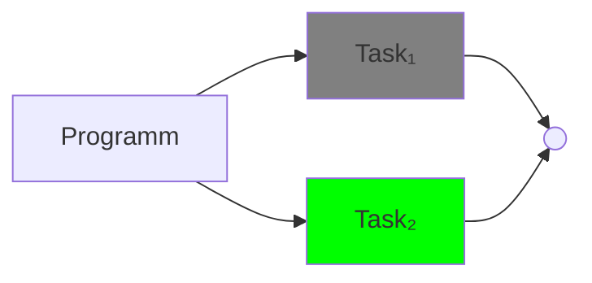
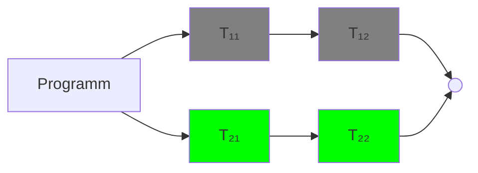

## Concurrency vs Parallelism

**Parallelität (Parallelism):**
- Techniken zur Beschleunigung von Programmen durch gleichzeitige Ausführung von Berechnungen
- Erfordert mehrere CPUs
- Berechnungseinheiten müssen unabhängig sein
- Ziel: Steigerung der Laufzeiteffizienz

**Nebenläufigkeit (Concurrency):**
- Programm macht Fortschritte bei mehreren Aufgaben zur gleichen Zeit
- Nebenläufige Programme können auf einer einzelnen CPU ausgeführt werden, können aber von mehreren CPUs profitieren
- Ziel: Effiziente Interaktion mit mehreren externen Agenten ermöglichen
- Nebenläufigkeit schließt Parallelität mit ein

**Im wesentlichen:**
- Parallelität bezieht sich auf die tatsächlich gleichzeitige Ausführung von Aufgaben (z.B. auf mehreren Prozessorkernen)
- Nebenläufigkeit beschreibt die Fähigkeit eines Programms, mehrere Aufgaben zu verwalten und voranzutreiben, auch wenn sie nicht unbedingt exakt gleichzeitig ausgeführt werden